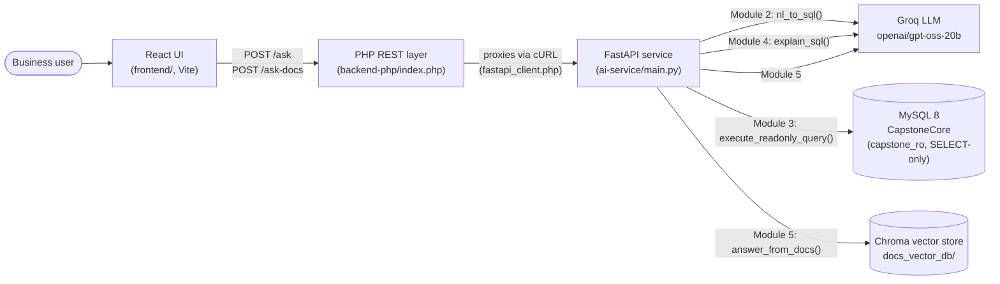

# Enterprise AI Data Assistant

Ask a business question about Contoso Trading Services in plain English and
get back the SQL that answers it, the actual results, and a plain-English
explanation of what the query did — plus a separate chat mode that answers
questions from uploaded policy documents (returns, warranty, sales terms).

Capstone project built on: **React → PHP REST → FastAPI → MySQL + Chroma**.

## Contents

- [Architecture](#architecture)
- [Tech stack](#tech-stack)
- [Repository structure](#repository-structure)
- [Prerequisites](#prerequisites)
- [Setup and run](#setup-and-run)
- [Environment variables](#environment-variables)
- [Using the app](#using-the-app)
- [API](#api)
- [Database](#database)
- [Security](#security)
- [Tests](#tests)
- [Status](#status)

## Architecture



PHP does no NL→SQL, no SQL execution, and holds no MySQL connection of its
own — it is a thin proxy. FastAPI's `db.py` is the only thing that ever
talks to MySQL, and it always connects as the read-only `capstone_ro` user.

A full request-by-request walkthrough of both flows (`/ask` and
`/ask-docs`) is in [`docs/architecture.md`](docs/architecture.md).

## Tech stack

| Layer | Technology |
|---|---|
| Frontend | React 19 + Vite |
| REST layer | PHP 8.2, built-in dev server |
| AI service | FastAPI + LangChain (Python 3.11) |
| LLM | Groq, `openai/gpt-oss-20b` |
| Embeddings | HuggingFace `sentence-transformers/all-MiniLM-L6-v2` (local, free) |
| Vector store | ChromaDB, persisted to disk |
| Database | MySQL 8 |

## Repository structure

```
enterprise-ai-data-assistant/
├── README.md
├── .env                  ← real secrets, gitignored
├── .env.example           ← placeholders, committed
├── db/                    schema, seed data, read-only user, *.sql scripts
├── docs/
│   ├── architecture.md    request-by-request walkthrough + diagrams
│   ├── api.md              endpoint reference
│   ├── schema_context.md   database schema fed to the LLM
│   └── samples/            policy documents used by Chat Docs (RAG)
├── ai-service/            FastAPI + LangChain (Python)
│   ├── main.py             FastAPI app + routes (/health, /ask, /ask-docs)
│   ├── llm_provider.py     only file that imports the Groq SDK
│   ├── nl2sql.py           Module 2 — English → SQL
│   ├── db.py               Module 3 — SQL guard + execution (capstone_ro)
│   ├── explain.py          Module 4 — structured SQL explanation
│   ├── ingest_docs.py      builds the document vector store
│   ├── rag.py               Module 5 — document Q&A
│   ├── requirements.txt
│   └── tests/
├── backend-php/           index.php (router), config.php, cors.php, fastapi_client.php
└── frontend/              React + Vite (Ask Data / Chat Docs)
```

## Prerequisites

- Windows with PowerShell
- Node.js 20+ and npm
- Python 3.11
- PHP 8.2
- MySQL 8.x, running locally with database `CapstoneCore` already created
  (see [Database](#database))
- A Groq API key (https://console.groq.com)

## Setup and run

All commands are PowerShell, run from the repo root unless noted.

**1. Clone and configure secrets**

```powershell
git clone git@github.com:ChiragAnblicks/enterprise-ai-data-assistant.git
cd enterprise-ai-data-assistant
Copy-Item .env.example .env
```

Open `.env` and fill in `GROQ_API_KEY` and `DB_RO_PASSWORD` (see
[Environment variables](#environment-variables)).

**2. Database** — if not already set up, see [Database](#database) below.
Skip this step if `CapstoneCore` and the `capstone_ro` user already exist.

**3. AI service (FastAPI)**

```powershell
cd ai-service
python -m venv .venv
.venv\Scripts\Activate.ps1
pip install -r requirements.txt
python ingest_docs.py
uvicorn main:app --reload --port 8000
```

`ingest_docs.py` only needs to be run once (or again whenever a file in
`docs\samples\` changes) — it builds the vector store `Chat Docs` reads
from. Leave `uvicorn` running in this window.

**Verify:** open http://127.0.0.1:8000/docs in a browser — you should see
the FastAPI interactive docs (Swagger UI) listing `/health`, `/ask`, and
`/ask-docs`.

**4. PHP REST layer** — in a new PowerShell window:

```powershell
cd backend-php
php -S localhost:8080 index.php
```

**Verify:**

```powershell
Invoke-RestMethod http://localhost:8080/health
```

should return `fastapi_reachable: True`. If it returns `False`, the
FastAPI service from step 3 isn't running or isn't reachable at the
`FASTAPI_BASE_URL` in `.env`.

**5. Frontend (React)** — in a new PowerShell window:

```powershell
cd frontend
npm install
npm run dev
```

Open the printed URL (normally http://localhost:5173/). Make sure
`frontend\.env.local` contains:

```
VITE_API_BASE_URL=http://localhost:8080
```

## Environment variables

Repo-root `.env` (copied from `.env.example`, gitignored):

| Variable | Used by | Meaning |
|---|---|---|
| `GROQ_API_KEY` | ai-service | Your Groq API key. Required. |
| `GROQ_MODEL` | ai-service | LLM model id, `openai/gpt-oss-20b`. |
| `DB_HOST` | ai-service | MySQL host, default `localhost`. |
| `DB_PORT` | ai-service | MySQL port, default `3306`. |
| `DB_NAME` | ai-service | Database name, `CapstoneCore`. |
| `DB_RO_USER` | ai-service | Read-only MySQL user, `capstone_ro`. |
| `DB_RO_PASSWORD` | ai-service | Password for `capstone_ro`. Required. |
| `FASTAPI_BASE_URL` | backend-php | Where PHP forwards requests, default `http://127.0.0.1:8000`. |
| `PHP_CORS_ALLOWED_ORIGIN` | backend-php | Origin allowed to call the PHP API, default `http://localhost:5173`. |

`frontend\.env.local` (gitignored; `frontend\.env.local.example` holds the
placeholder and is committed):

| Variable | Meaning |
|---|---|
| `VITE_API_BASE_URL` | Base URL of the PHP REST layer, e.g. `http://localhost:8080`. |

## Using the app

The React UI has two modes:

- **Ask Data** — type a business question (e.g. *"What were total sales by
  region last year?"*). Returns the generated SQL, the result rows, and a
  structured explanation (summary, tables used, filters, grouping, sorting,
  row limit, caveats).
- **Chat Docs** — ask about return policy, warranty terms, or sales policy.
  Answers are grounded only in the files in `docs\samples\`
  (`ReturnPolicy.txt`, `SalesPolicy.pdf`, `WarrantyTerms.docx`) and say so
  when the answer isn't in those documents.

## API

Full reference with request/response examples: [`docs/api.md`](docs/api.md).

Summary — the PHP REST layer (`http://localhost:8080`) exposes:

| Method | Path | Purpose |
|---|---|---|
| GET | `/health` | PHP liveness + FastAPI reachability |
| POST | `/ask` | English question → SQL → rows → explanation |
| POST | `/ask-docs` | Question answered from `docs/samples/` |

FastAPI itself (`http://127.0.0.1:8000`) exposes the same three routes
directly, plus interactive docs at `/docs`.

## Database

Scripts in `db\`, run in order against a local MySQL 8 server:

```powershell
Get-Content db\00_CommandsToCreateNewDatabase.sql | mysql -u root -p
Get-Content db\01_schema.sql | mysql -u root -p CapstoneCore
Get-Content db\02_seed_data.sql | mysql -u root -p CapstoneCore
Get-Content db\03_readonly_user.sql | mysql -u root -p
```

This creates `CapstoneCore` (11 tables: `regions`, `categories`,
`suppliers`, `shippers`, `employees`, `customers`, `products`, `orders`,
`order_items`, `payments`, `product_returns`), loads sample data for the
fictional company **Contoso Trading Services**, and creates the read-only
`capstone_ro` user used by `ai-service/db.py`. `04_generate_schema_context.sql`
regenerates `docs/schema_context.md` if the schema ever changes — that file
is what grounds the LLM's SQL generation and explanations, so re-run it
after any schema edit.

Full column-level schema: [`docs/schema_context.md`](docs/schema_context.md).

## Security

- **Read-only DB access.** `ai-service` connects to MySQL only as
  `capstone_ro`, a user with `SELECT`-only privileges — enforced at the
  MySQL grant level, not just in application code.
- **Independent SQL guard.** Every generated statement is re-validated in
  `db.py` regardless of what `nl2sql.py` already checked: must parse as
  exactly one statement, must start with `SELECT`/`WITH`, must not contain
  any write/DDL/session keyword, and gets a row cap (`LIMIT 200` by
  default) rewritten or appended before it runs.
- **No secrets in source.** `.env` lives at the repo root and is
  gitignored; `.env.example` and `frontend\.env.local.example` hold
  placeholders only.
- **No absolute paths in code.** All paths are resolved relative to the
  repo root at runtime, so the project runs after a plain `git clone` on
  any machine.

## Tests

```powershell
cd ai-service
.venv\Scripts\Activate.ps1
pytest
```

Covers `nl2sql.py`, `explain.py`, and `llm_provider.py` (`ai-service\tests\`).

## Status

See the project checklist for what's built vs. remaining. As of this
README: database, both backend services, and the React UI (Ask Data / Chat
Docs) are working end-to-end. Remaining: demo video.
