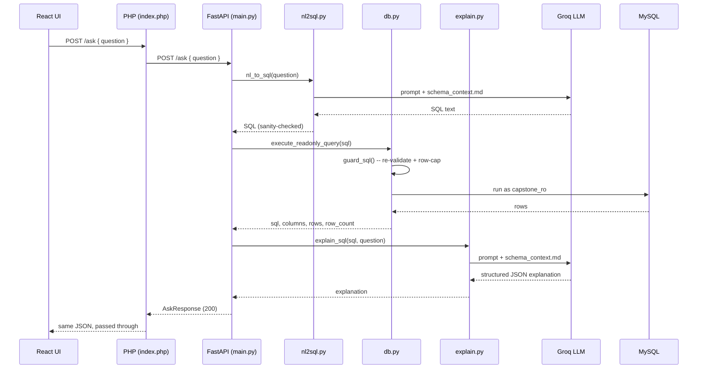
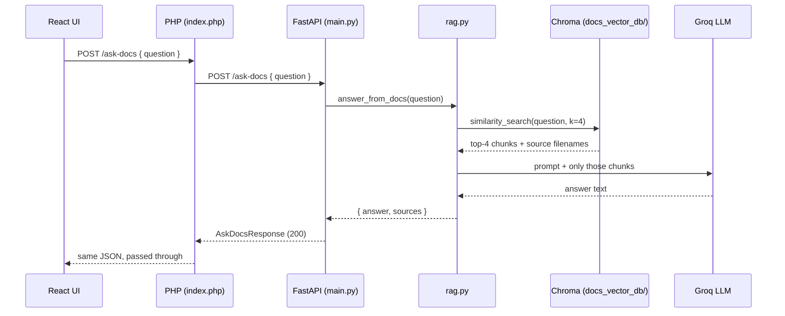

# Architecture

## Layers

```
React (frontend/)  --HTTP-->  PHP REST (backend-php/)  --HTTP-->  FastAPI (ai-service/)  -->  MySQL + Chroma
```

Each layer only talks to the one next to it:

- **React** never calls FastAPI directly, and never talks to MySQL. It only
  knows the PHP layer's base URL (`frontend\.env.local` →
  `VITE_API_BASE_URL`).
- **PHP** (`backend-php/index.php`) is a pure proxy. It has no MySQL
  connection, no LLM calls, and no SQL logic of its own — `cors.php`
  handles CORS/preflight, `config.php` loads settings from the repo-root
  `.env`, and `fastapi_client.php` forwards the request to FastAPI over
  cURL and returns its response body and status code unchanged.
- **FastAPI** (`ai-service/main.py`) does all the real work, split into
  independent modules it wires together per route.
- **MySQL** is only ever reached from `db.py`, only as the read-only
  `capstone_ro` user. **Chroma** (the vector store) is only ever reached
  from `rag.py`.

## POST /ask — request flow



Two independent things can go wrong and are handled separately:

- If `nl_to_sql()` can't produce safe SQL (ambiguous question, or it fails
  `nl2sql.py`'s own sanity check), the whole request fails with `422`
  before anything touches MySQL.
- If `explain_sql()` fails *after* the query already ran successfully, the
  response still returns `200` with the real `sql`/`columns`/`rows` —
  `explanation` is `null` and `explanation_error` explains why. A flaky
  explanation step never hides a working answer.

`db.py`'s guard runs independently of `nl2sql.py`'s own checks — even if
the LLM's output already looks safe, `execute_readonly_query()` re-parses
it, rejects anything that isn't a single `SELECT`/`WITH` statement, blocks
a fixed list of write/DDL/session keywords, and rewrites or appends a
`LIMIT` so no query can return more than `SQL_MAX_ROWS` (default 200) rows.
That guard is the actual security boundary — not `nl2sql.py`'s
sanity-check, which only exists to catch obvious mistakes early.

## POST /ask-docs — request flow



The vector store is built ahead of time by `ai-service/ingest_docs.py`,
which reads every file in `docs/samples/`, splits them into ~1000-character
chunks (150-character overlap), embeds them locally with HuggingFace
`all-MiniLM-L6-v2` (no API cost), and persists them to
`ai-service/docs_vector_db/`. `rag.py` only *reads* that store — if it
hasn't been built yet, `answer_from_docs()` raises immediately rather than
silently returning nothing.

The LLM is instructed to answer only from the retrieved chunks and to say
plainly when the documents don't cover the question, rather than guessing
— so an unanswerable question is a normal `200` response with a fixed
"couldn't find that" message, not an error.

## Why the module boundaries are drawn this way

Each Python module in `ai-service/` does exactly one job and is safe to run
and test standalone (`python nl2sql.py`, `python db.py`, `python
explain.py`, `python rag.py`, each have a `__main__` smoke test):

- **`nl2sql.py`** only generates and lightly sanity-checks SQL text. It
  never executes anything.
- **`db.py`** is the only module that ever opens a MySQL connection, and
  the only real security boundary — it re-validates SQL independently of
  whatever produced it.
- **`explain.py`** only explains SQL text that has *already run* — it
  receives the guarded, row-capped SQL from `db.py`'s result, not the raw
  LLM output, so the explanation always describes what actually executed.
- **`rag.py`** only reasons over document text. It never touches MySQL and
  is not a security boundary.
- **`llm_provider.py`** is the only file in the whole project that imports
  the Groq SDK — every other module calls `call_llm()`, so swapping LLM
  providers later touches one file.

This means a bug or outage in one module degrades gracefully rather than
taking down the others — e.g. `/ask` still returns real query results even
if `explain_sql()` is failing, and `/ask-docs` failing has no effect on
`/ask`.
